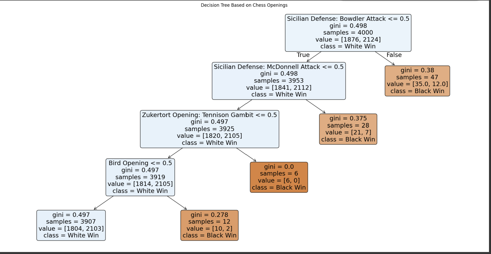

# Chess Openings Classification using Decision Tree

## Overview
This project analyzes chess openings and their impact on game outcomes using a Decision Tree classification model. The study uses real-world data from Lichess to identify patterns between openings and match results, providing a data-driven approach to understanding opening effectiveness.

## Objective
- To classify chess game outcomes (White win or Black win) based on the opening played  
- To identify the most influential openings affecting game results  

## Dataset
- Source: Lichess PGN Database  
- Sample Size: 100,000 standard-rated games  
- Data extracted:
  - Opening names  
  - Game results (White win / Black win)  

Draws were removed and results were converted into binary format.

## Methodology

### Data Preparation
- Extracted opening and result information from PGN files  
- Removed draws  
- Applied one-hot encoding to opening names  

### Model Building
- Split dataset into training (80%) and testing (20%)  
- Applied Decision Tree Classifier (max_depth=4)  
- Visualized the decision tree  

### Evaluation Metrics
- Accuracy  
- Precision  
- Recall  
- F1-score  
- Confusion Matrix  

## Results and Analysis

According to the analysis in the report :contentReference[oaicite:0]{index=0}:

- The model achieved approximately 56%–78% accuracy depending on evaluation context  
- Strong performance in predicting White wins (high recall ~0.98)  
- Lower performance for Black wins due to class imbalance  

### Key Insights
- Sicilian Defense: Bowdler Attack is the most influential opening  
- Alapin Variation and McDonnell Attack also significantly impact outcomes  
- Vant Kruijs Opening is the most frequently played (~38.6%)  
- Most openings show a higher probability of White wins  
- Slav Defense shows more balanced outcomes  

## Tools and Technologies
- Python  
- Pandas  
- Scikit-learn  
- Matplotlib  
- Google Colab

[View Full Report 👉](report/chess_opening_classification_report.pdf)
[csv file 👉](csv_chess_openings/openings.csv)
[decision tree png 👉](png/decision_tree.png)
[Python code 👉](python_code/chess_opening_analysis.py)

Decision tree -- Image

